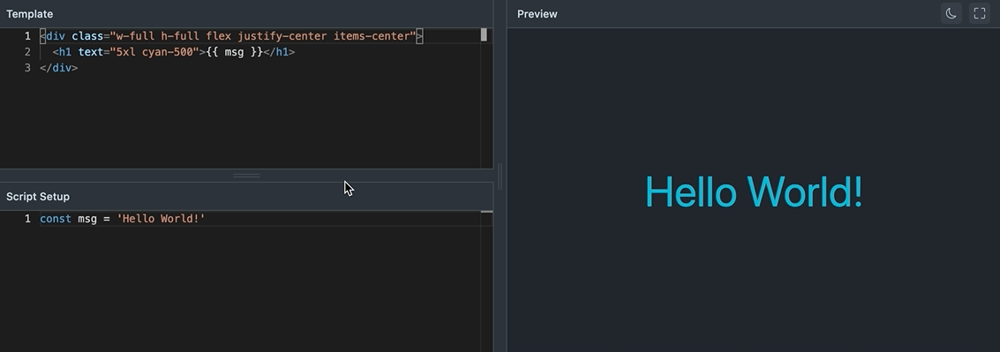

<h1 align="center">Vue SFC Sandbox</h1>

<div align="center">

<p align="center">
  Vue SFC Sandbox, Sandbox as a Vue 3 component.
</p>

<br>

[![NPM][npmBadge]][npmUrl]
[![NPM Download][npmDtBadge]][npmDtUrl]
[![License][licenseBadge]][licenseUrl]

[npmBadge]:https://img.shields.io/npm/v/vue-sfc-sandbox.svg?maxAge=2592000
[npmUrl]:https://www.npmjs.com/package/vue-sfc-sandbox

[npmDtBadge]:https://img.shields.io/npm/dt/vue-sfc-sandbox.svg
[npmDtUrl]:https://www.npmjs.com/package/vue-sfc-sandbox

[licenseBadge]:https://img.shields.io/badge/license-MIT-blue.svg
[licenseUrl]:https://raw.githubusercontent.com/vueblocks/vue-sfc-sandbox/master/LICENSE

</div>

## 🖼️ Preview



## ✨ Features

### 🗳️ Sandbox

* 💪 Fully Typed
* 📁 Virtual File System (Support Compile `.vue/.js` File). based on [vue-sfc2esm](https://github.com/xiaoluoboding/vue-sfc2esm)
* 👬 Friendly Error Tips. based on [vue-sfc2esm](https://github.com/xiaoluoboding/vue-sfc2esm)
* 🧪 Transpiled SFC File to ES Modules.
* 🔌 Support Externals CDN, like [unpkg](https://unpkg.com/)、[jsdelivr](https://www.jsdelivr.com/) etc.
* 🧩 Load [Import Maps](https://github.com/WICG/import-maps) as ES Modules.
* 💨 Built-in Compile `windicss` on the fly, also support `attributify` mode.

### ✏️ Editor Panel

* 🎨 Themeable Editor based on [Monaco Editor](https://github.com/microsoft/monaco-editor)
* 🧑‍💻 Developer Friendly, built-in `Vue 3` intellisense support
* ↕️ REPL Sandbox with Split Panes, Split `<template>` & `<script>` tag

### 👓 Preview Panel

* ⚡️ Runtime Compile SFC File
* 🔍 Fullscreen View
* 🌛 Darkmode

## 💡 Inspiration

This project is heavily inspired by [Vue SFC Playground](https://github.com/vuejs/vue-next/tree/master/packages/sfc-playground). Actually Copied from it.

## 📦 Installation

```bash
yarn add vue-sfc-sandbox -S
or
npm i vue-sfc-sandbox -S
```

## 📖 Usage

> Notice that `vue-sfc-sandbox` is depending on `@vue/compiler-sfc`, and `@vue/compiler-sfc` depending on `Consolidate` packages.
> We need configure `Consolidate` as externals in `vue.config.js` or `vite.config.ts` file.

### Demos

Vue 3 Demo: [Vue CLI 3.x](./examples/vue3-demo/README.md) | Vite 2 Demo: [@vitejs/app](./examples/vite2-demo/README.md)

### Configure Vue 3

Add this config in [vue.config.js](./examples/vue3-demo/vue.config.js) file.

```ts
// vue.config.js in vue 3 project
module.exports = {
  ...
  configureWebpack: {
    externals: {
      consolidate: 'Consolidate'
    }
  }
  ...
}
```

### Configure Vite 2

Add this config in [vite.config.ts](./examples/vite2-demo/vite.config.ts) file.

```ts
import { defineConfig } from 'vite'
import vue from '@vitejs/plugin-vue'

// https://vitejs.dev/config/
export default defineConfig({
  define: {
    'process.env': {}
  },
  plugins: [vue()],
  optimizeDeps: {
    exclude: ['consolidate', 'velocityjs', 'dustjs-linkedin', 'atpl', 'liquor', 'twig', 'ejs', 'eco', 'jazz', 'hamljs', 'hamlet', 'jqtpl', 'whiskers', 'haml-coffee', 'hogan.js', 'templayed', 'handlebars', 'underscore', 'lodash', 'walrus', 'mustache', 'just', 'ect', 'mote', 'toffee', 'dot', 'bracket-template', 'ractive', 'htmling', 'babel-core', 'plates', 'react-dom/server', 'react', 'vash', 'slm', 'marko', 'teacup/lib/express', 'coffee-script', 'squirrelly', 'twing']
  }
})
```

### Setup SFC Sandbox Component

```ts
// main.ts
import { createApp } from 'vue'
import App from './App.vue'

import VueSfcSandbox from 'vue-sfc-sandbox'

createApp(App)
  .use(VueSfcSandbox)
  .mount('#app')
```

### Use SFC Sandbox Component

```html
<template>
  <!-- [ESM] default case with <script setup> -->
  <sfc-sandbox v-bind="defaultAttrs" />
</template>

<script lang="ts">
import { defineComponent } from 'vue'

export default defineComponent({
  name: 'HelloWorld',

  setup () {
    const defaultAttrs = {
      scriptSetup: true,
      height: 200,
      sfcFilename: 'DefaultDemo.vue',
      sfcCode: `
        <template>
          <h1>{{ msg }}</h1>
        </template>

        <script setup>
        const msg = 'Hello World!'
        </script>
      `
    }

    return {
      defaultAttrs
    }
  }
})
</script>
```

## Props

| Attribute | Description | Type | Accepted values | Default |
|:--------:|--------|--------|:--------:|:--------:|
| height | the sandbox height unit (px) | Number | - | 400 |
| import-maps | specify a import maps in the `<script>` element include `type=\"importmap\"` | String | - | - |
| externals | specify some cdn like jsdelivr、unpkg | String | - | - |
| sfc-filename | virtual sfc filename like `HelloWorld.vue` | - | - |
| sfc-code | transpile sfc code to es modules by `vue-sfc2esm` | String | - | - |
| script-setup | whether script editor using `<script setup>` proposal | Boolean | `true`/`false` | `false` |

## 💻 Development

```bash
yarn install
```

### Compiles and hot-reloads for development

```bash
yarn serve
```

### Compiles and minifies for production

```bash
yarn build
```

### Lints and fixes files

```bash
yarn lint
```

## 🗃️ Similar Repos

* [vuep](https://github.com/QingWei-Li/vuep) - 🎡 A component for rendering Vue components with live editor and preview.
* [codepan](https://github.com/egoist/codepan) - Like codepen and jsbin but works offline.
* [demosify](https://github.com/demosify/demosify) - Create a playground to show the demos of your projects.

## 📄 License

MIT [@xiaoluoboding](https://github.com/xiaoluoboding)
