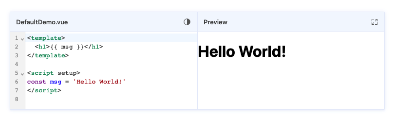

# Vue SFC Sandbox

> Vue SFC Sandbox built on top of `@vue/compiler-sfc`

## 🖼️ Preivew



## ✨ Features

* 💪 Fully Typed
* 📁 Virtual File System (Support Compile `.vue/.js` File). based on [vue-sfc2esm](https://github.com/xiaoluoboding/vue-sfc2esm).
* 👬 Friendly Error Tips. based on [vue-sfc2esm](https://github.com/xiaoluoboding/vue-sfc2esm).
* 🧪 Transpiled SFC File to ES Modules.
* 🔌 Load Externals CDN
* 🔌 Load [Import Maps](https://github.com/WICG/import-maps) as ES Modles.
* 🔍 Fullscreen View
* 🌛 Darkmode Editor
* 🧑‍💻 Developer Friendly - Code highlighting, REPL Sandbox with Split Panes.

## 💡 Inspiration

This project is heavily inspired by [Vue SFC Playground](https://github.com/vuejs/vue-next/tree/master/packages/sfc-playground). Actually Copied from it.

## 📦 Installation

```bash
yarn add vue-sfc-sandbox -S
or
npm i vue-sfc-sandbox -S
```

## 💻 Development

```bash
yarn install
```

### Compiles and hot-reloads for development

```bash
yarn serve
```

### Compiles and minifies for production

```bash
yarn build
```

### Lints and fixes files

```bash
yarn lint
```

## 📄 License

MIT [@xiaoluoboding](https://github.com/xiaoluoboding)
